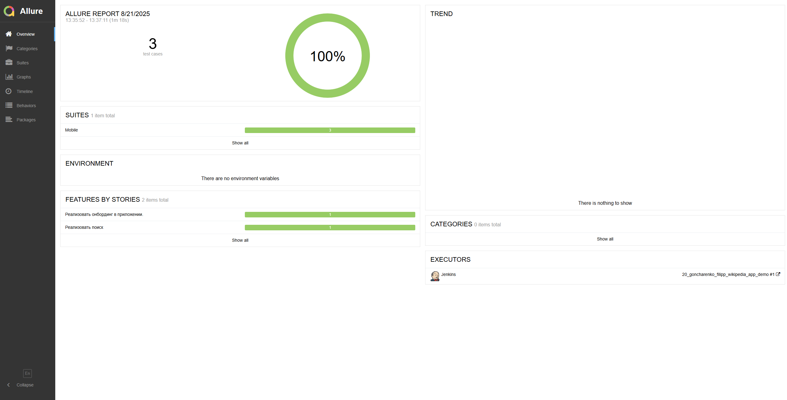
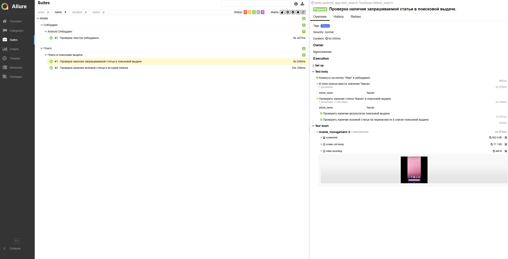
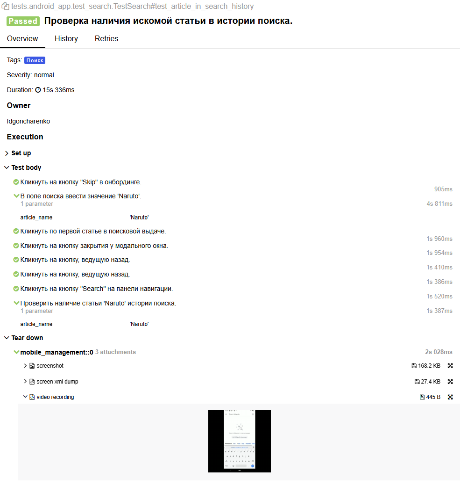
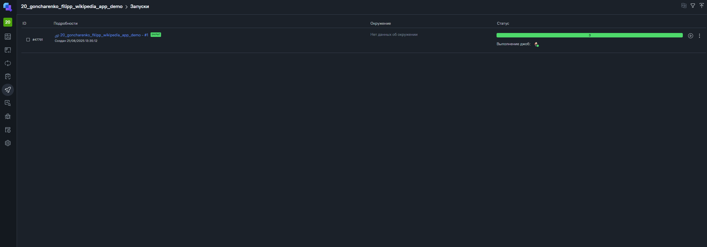
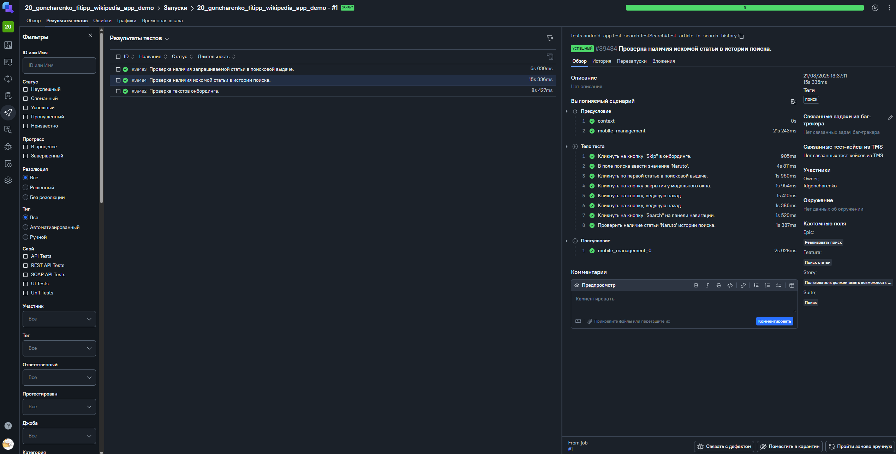
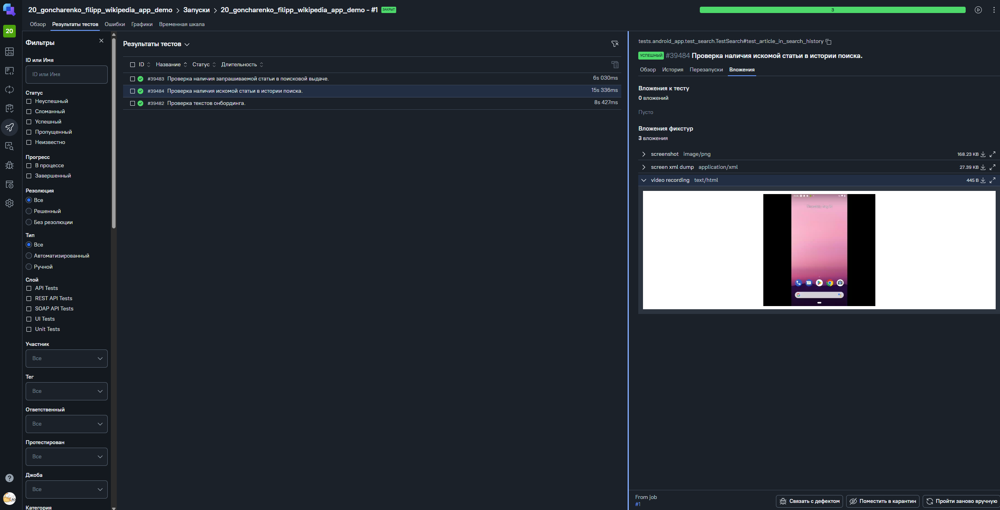
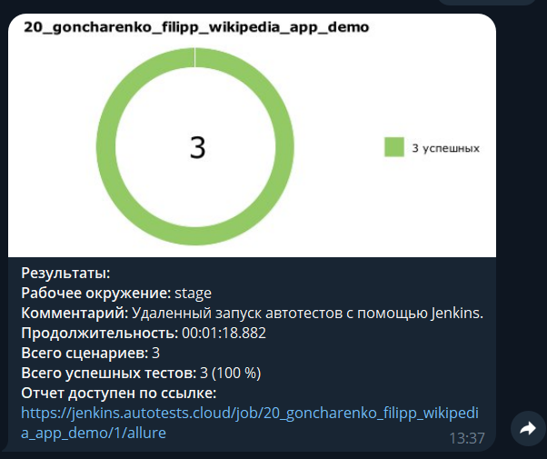
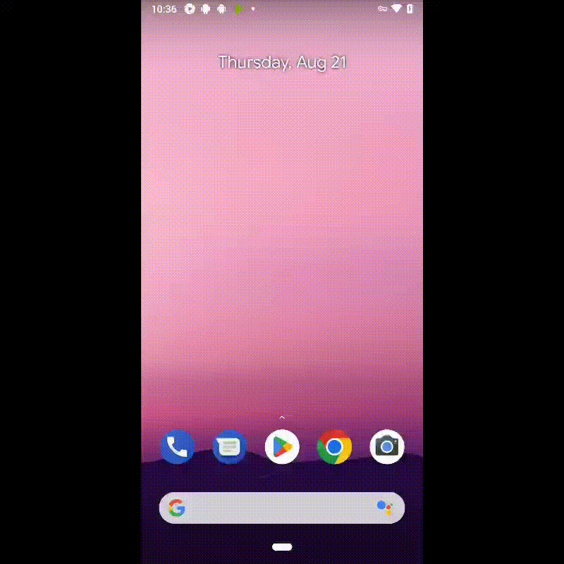

# Демо-проект по автоматизации мобильного приложения Wikipedia на Android

----
### Проект реализован с использованием:


----

### Особенности проекта

* Отчеты с видео, скриншотом, исходной моделью разметки страницы
* Сборка проекта в Jenkins
* Запуск тестов удаленно на Browserstack или локально
* Отчеты Allure Report
* Интеграция с Allure TestOps
* Оповещения о тестовых прогонах в Telegram

 ### Список реализованных проверок

- [x] Проверка наличия запрашиваемой статьи в поисковой выдаче.
- [x] Проверка текстов онбординга.
- [x] Проверка наличия искомой статьи в истории поиска.

____

### Локальный запуск
Для возможности локального запуска необходимо подготовить систему: установить Android Studio и Appium.
<a href="https://github.com/qa-guru/knowledge-base/wiki/20.-%D0%9C%D0%BE%D0%B1%D0%B8%D0%BB%D1%8C%D0%BD%D0%B0%D1%8F-%D0%B0%D0%B2%D1%82%D0%BE%D0%BC%D0%B0%D1%82%D0%B8%D0%B7%D0%B0%D1%86%D0%B8%D1%8F-%232.-%D0%A0%D0%B0%D0%B7%D1%80%D0%B0%D0%B1%D0%B0%D1%82%D1%8B%D0%B2%D0%B0%D0%B5%D0%BC-%D0%B0%D0%B2%D1%82%D0%BE%D1%82%D0%B5%D1%81%D1%82%D1%8B-%D1%81-%D1%8D%D0%BC%D1%83%D0%BB%D1%8F%D1%82%D0%BE%D1%80%D0%BE%D0%BC-Android-%D1%83%D1%81%D1%82%D1%80%D0%BE%D0%B9%D1%81%D1%82%D0%B2%D0%B0-python">Инструкция по установке.</a>

> Для локального запуска необходимо выполнить команды:
```
python -m venv .venv
source .venv/bin/activate
pip install -r requirements.txt
pytest --context=local_emulator
```
----

### Удаленный запуск автотестов выполняется в Jenkins или в Allure TestOps
> <a href="https://jenkins.autotests.cloud/job/20_goncharenko_filipp_wikipedia_app_demo/">Ссылка на проект в Jenkins</a>

> <a href="https://allure.autotests.cloud/project/4891/dashboards">Ссылка на проект в Allure TestOps</a>

#### Для запуска автотестов в Jenkins

1. Открыть <a target="_blank" href="https://jenkins.autotests.cloud/job/20_goncharenko_filipp_wikipedia_app_demo/">проект</a>
2. Нажать кнопку `Build Now`
3. Результат запуска сборки можно посмотреть в отчёте Allure, в запуске Allure TestOps

#### Для запуска автотестов в Allure TestOps

1. Открыть <a target="_blank" href="https://allure.autotests.cloud/project/4891/dashboards">проект</a>
2. В боковом меню перейти на вкладку "Джобы".
3. Кликнуть кнопку "Запустить джобу" у `20_goncharenko_filipp_wikipedia_app_demo`
4. В открывшемся модальном окне при необходимости указать название и другую мета-информацию.
5. Кликнуть на кнопку "Отправить".
6. Отслеживать выполнение можно на вкладке<a target="_blank" href="https://allure.autotests.cloud/project/4891/launches">"Запуски"</a>.


----

### Параметры pytest при локальном запуске

<code>pytest --context=local_emulator</code> – запуск тестов локально на эмуляторе.

<code>pytest --context=local_real_device</code> – запуск тестов локально на девайсе.

<code>pytest --context=bstack</code> – запуск тестов на BrowserStack (понадобится файл <code>.env.credentials</code> с данными учетной записи BrowserStack).


### Allure отчет


#### Общие результаты


#### Список тест кейсов в Allure 


#### Пример тест кейса в Allure с логированием и вложениями


### Allure TestOps

#### Примеры запуска в Allure TestOps

<br>

<br>


#### Нотификация в Telegram


#### Видео прохождения теста
